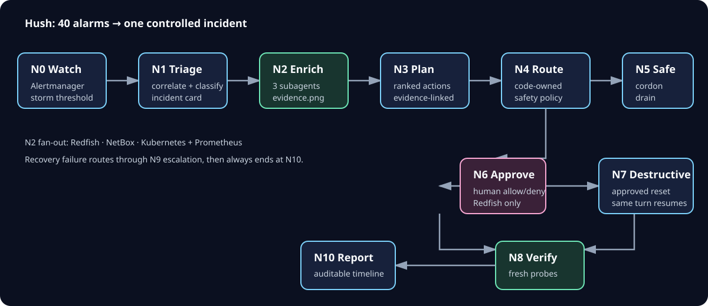

# Hush

Hush is an autonomous data-center incident triager and operator. It turns a
large alert storm into one evidence-backed root cause, enriches the incident
across infrastructure systems, proposes remediation, executes safe actions,
and requires a human decision before any destructive Redfish action.

> 40 alarms in → 1 root cause out → 0 humans paged → 1 approval before
> anything irreversible.

Hush is a hackathon project built on the TrueForge agent harness. The data
center hardware is simulated; the APIs, alert flow, Kubernetes operations,
approval gate, and audit trail are real.



## What happens during an incident

1. Alertmanager supplies the live alert stream.
2. Deterministic code groups related alerts; GPT-5.6-Luna classifies the likely
   root cause.
3. Three subagents gather evidence from Redfish, NetBox, Kubernetes, and
   Prometheus.
4. Hush ranks remediation actions and validates them against a fixed tool
   registry.
5. Safe Kubernetes actions such as cordon and drain can run automatically.
6. Reset or shutdown actions pause at the TrueForge approval gate.
7. Hush verifies recovery and writes an auditable incident report.

The project supports two repeatable demo scenarios: a rack cooling (CRAC)
failure cascade and a hung Kubernetes node.

## Graph engineering

| Stage         | Kind                            | Responsibility                                            | Guardrail                        |
| ------------- | ------------------------------- | --------------------------------------------------------- | -------------------------------- |
| N0 watch      | deterministic                   | Detect an alert storm                                     | Fixed count and time window      |
| N1 triage     | agentic                         | Correlate and classify one incident                       | Typed incident schema            |
| N2 enrich     | agentic + subagents             | Join Redfish, NetBox, Kubernetes, and Prometheus evidence | Three isolated subagents         |
| N3 plan       | agentic                         | Rank evidence-linked actions                              | Fixed tool registry              |
| N4–N7 execute | deterministic + agentic + human | Route safe actions and pause destructive actions          | Code-owned policy and approval   |
| N8–N10 close  | deterministic + agentic         | Verify, escalate if needed, and report                    | Fresh probes and bounded retries |

The complete node and edge contracts are in
[the execution graph specification](specs/graph.md).

## Safety model

- Redfish reset and shutdown actions always require human approval.
- Kubernetes writes are limited to cordon, drain, uncordon, and reschedule.
- NetBox is read-only.
- Side-effecting MCP calls use idempotency keys.
- Code, rather than the model, decides whether a tool is safe or destructive.
- Secrets, local databases, run logs, and generated reports are not committed.

## Technology

Hush uses TrueForge in local mode with **OpenAI GPT-5.6-Luna only**
(`openai/gpt-5-6-luna`). There is no alternate-model fallback. The controller
is strict TypeScript; the mock BMC and planned MCP services are Python 3.12.
The demo stack uses FastAPI/Redfish, Prometheus, Alertmanager, a three-node
kind cluster, NetBox, and remote streamable-HTTP MCP servers.

See [the locked technology choices](specs/tech-stack.md) and
[the execution graph and tool contracts](specs/graph.md) for details.

## Repository map

| Path                    | Purpose                                                       |
| ----------------------- | ------------------------------------------------------------- |
| `specs/mission.md`      | Product scope, scenarios, and success criteria                |
| `specs/tech-stack.md`   | Locked tools, versions, ports, and environment variables      |
| `specs/graph.md`        | Execution graph, state, safety policy, and MCP contracts      |
| `specs/roadmap.md`      | Build sequence, ownership, and definitions of done            |
| `hush/`                 | TrueForge controller, graph runner, prompts, and registration |
| `skills/hush-triage/`   | Importable data-center triage runbook                         |
| `docs/architecture.svg` | Incident graph used in this guide                             |
| `mock-bmc/`             | FastAPI mock BMC with a Redfish-compatible API                |
| `.env.example`          | Safe local configuration template; contains no credentials    |

Folders described in the roadmap, including `mcp/`, `chaos/`, and `infra/`,
will appear as their phases land. Do not assume roadmap examples are already
implemented.

## Current status

Person B phases B0 through B4 are present on `main`: the graph runner,
TrueForge adapter, triage, parallel enrichment, planning, approval-gated
execution, verification, and reporting are implemented. B5 adds the operator
runbook, Generative UI guidance, and clean-clone documentation.

## Get started as a contributor

Prerequisites:

- Git
- Node.js 22.14 or newer
- Python 3.12 and `uv`
- Docker Desktop, `kind`, and `kubectl` for later integration phases

Clone the repository, then create your local environment file:

```bash
git clone <repository-url>
cd Agent-Harness-Hackathon
cp .env.example .env
```

Replace only the safe placeholders in `.env`. Keep
`HUSH_MODEL=openai/gpt-5-6-luna`; Hush supports no other model. Never commit
`.env` or an API key.

Run the checks that are available today:

```bash
cd hush
npm ci
npm test
npm run build
npm run lint
```

CI runs the same TypeScript checks, the Python test suite, and gitleaks on each
pull request. From the repository root, `make test` runs the Python lint,
type-check, and test suite with `uv`.

The mock BMC has its own setup and API examples in
[`mock-bmc/README.md`](mock-bmc/README.md).

## TrueForge setup

Start TrueForge locally:

```bash
npx @truefoundry/trueforge@latest
```

Open `http://localhost:8790`, add an OpenAI API key under **Settings →
Models**, and select `openai/gpt-5-6-luna`. Do not add a model fallback. Daytona
is the planned sandbox provider. If the provider dialog renders empty, configure
it over the API instead: put the key in `~/.hush-openai-key` and run
`uv run python scripts/configure_openai.py`, which never writes it to the repo.

With the five local MCP servers running, register or update the connectors, the
`hush-triage` skill and the `hush-operator` agent — the skill lives at a public
GitHub path, so it imports over REST with no OAuth step:

```bash
cd hush
npm ci
npm run register
```

Set `TRUEFORGE_BASE_URL` to use a different local TrueForge URL. Keep
`HUSH_MODEL=openai/gpt-5-6-luna`; other models are unsupported. The registration
command loads these values from the root `.env` when it exists. Registration is
idempotent and safe to rerun after changing the agent manifest or system prompt.

## Working agreements

- Read the relevant spec before changing code; `AGENTS.md` contains the full
  project rules.
- Branch each roadmap phase from the latest `origin/main` only after its
  predecessor merges.
- Use Conventional Commits and keep changes scoped to one roadmap phase.
- Run the narrowest relevant tests, lint, and build checks.
- Every substantive pull request must receive a Qodo review; address High
  findings before merge and record the result in the PR template.

## Learn more

- [Mission and acceptance criteria](specs/mission.md)
- [Tech stack](specs/tech-stack.md)
- [Execution graph and MCP contracts](specs/graph.md)
- [Implementation roadmap](specs/roadmap.md)
- [Mock BMC guide](mock-bmc/README.md)
- [DC-Sentinel ELI5](dc_sentinel_eli5_standalone.html) — kid-friendly, standalone
  walkthrough of the project

## Qodo Code Review Evidence

Qodo review is required for every substantive pull request.

- [PR #7 — TrueForge adapter and registration](https://github.com/Shradhapujari/Agent-Harness-Hackathon/pull/7): Qodo review feedback was incorporated before merge; the final change keeps harness I/O behind a typed adapter and registration idempotent.
- [PR #14 — triage, enrichment, and planning nodes](https://github.com/Shradhapujari/Agent-Harness-Hackathon/pull/14): Qodo surfaced bounded-execution and stale-plan risks; follow-up commits added node timeouts, stricter plan replacement, and regression tests.

## Limits, team, and license

Hush intentionally supports one rack, two deterministic scenarios, and one
model. The BMC is simulated, NetBox writes are forbidden, and Kubernetes
changes are limited to cordon, drain, uncordon, and rescheduling. See
[the full non-goals](specs/mission.md#6-non-goals-say-no).

The two-person project is split at the MCP boundary: Person A owns the
simulated data center and tool servers; Person B owns the Hush controller,
TrueForge integration, CI, and demo materials. Hush is licensed under the
[MIT License](LICENSE).
